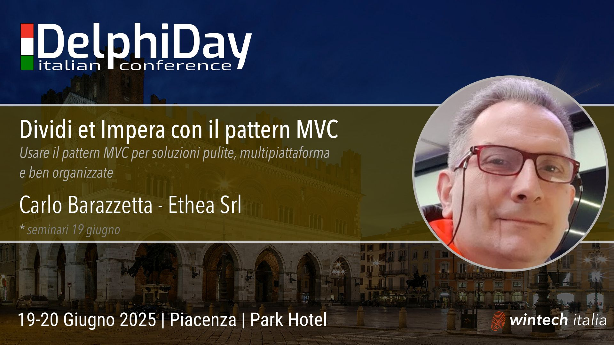

# Delphi MVC 

Samples of Delphi App with MVC Pattern, used for educational purposes.

Please note: The examples are simplified and not complete.

# Examples:

## Calculator

1. Calculator_VCL_Flat (no MVC)
1. Calculator_MVC

## Orders/Customers

1. MVC_Simple_Orders
1. MVC_Orders_Customers
1. MVC_Orders_Customers_IO

# Delphi Day 2025

_Demos and exercises for Delphi Day Seminar - Piacenza 16 June 2025_

# Licensing

Copyright (c) 2025 (Ethea S.r.l.)
Author: Carlo Barazzetta

Licensed under the Apache License, Version 2.0 (the "License");
